# Datenreihen

Zahlen- oder Datumsreihen in Excel per Hand vorzugeben, ist eine stupide, vor allem aber unnötige Arbeit, denn das Programm hat mit Auto Ausfüllen eine besondere Funktion parat, die automatisch Werte einfügt.

Heute werden wir uns also mit einem sehr wichtigen Feature von Excel beschäftigen. Excel kann zählen, das kann man gut nutzen.

Datenreien sind im Prinzip fortlaufende Daten. Z.B. fortlaufende Nummern (1, 2, 3, ...), oder Zahlen die einem bestimmten Muster weitergezählt werden (1, 3, 5, ...) oder auch Datumswerte die automatisch weitergezählt werden sollen. Es wäre natürlcih sehr mühsam, wenn man eine Tabelle mit 200 solchen Werten erstellen müsste und dabei alle Nummern selbst eingeben müsste.

Das geht einfacher.

## Nummern

Also öffne Excel und setzte den Cursor in die erste Zeile in die erste Spalte und gib 1 ein. In der markierten Zelle rechts unten ist ein kleines Kreuz. Wenn man mit dem Curmsor darüber fährt, wird es etwas größer.

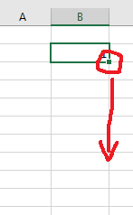

Klick darauf und ziehe die Maus nach unten. Es werden dann alle markierten Zellen darunter auch die Zahl 1 geschrieben. Soweit so gut, das ist ja ganz praktisch, aber das zählt ja nicht weiter. Das zu ralisieren, ist ganz einfach. Während man die Maus hinunter zieht, auch die **STRG**-Taste drücken. Dann kann man schon in der vorschau rechts daneben sehen, dass die Zahl hinaufgezählt wird.

Eine zweite Möglihkeit ist, wenn man die STRG-Taste aus welchem Grund auch immer nicht drücken möchte, kann man in der ersten Zelle die Zahl 1 und in der Zelle darunter die Zahl 2 eingeben. Dann markiert man beide Zellen (also einen Bereich von Zellen oder auch Range) und zieht die Maus nach unten:

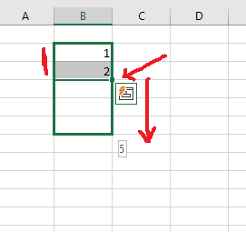

Excel ist nun so schlau und erkennt das die beiden eingegebenen Zahlen anscheinend fortlaufend sind und Zählt automatisch weiter.

Probiere das mal aus.

Excel ist aber noch schlauer und erkennt auch andere Folgen. Also Zahlen die nicht unbedingt direkt aufeinander folgen, wie z.B. 1, 3. Gibt man in die erste Zelle 1 ein und in die Zelle darunter 3 ein und wiederholt dann das ganze, so erkennt Excel das hier offensichtlich mit einem Abstand von 2 gezählt werden muss.

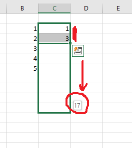

Wiederhole das für 50 Zeilen mit:

* 1, 5, ...
* 1, 10, ...
* 2, 4, ...
* 8, 16, ...

Das Ganze klappt natürlich auch bei horizontalen Datenreihen, wo Du also nach rechts ziehst oder mit fallenden Werten. Schreibe also in die erste Zelle 100, darunter 99, dann wird in diesem Fall weiter nach unten gezählt.

Wiederhole das in Zeile 55 für für 20 Spalten mit:

* 3, 6, ...

## Datumswerte

Das ganze funktioniert nicht nur für Nummern, sondern für fast alles was sich abzählen lässt. Abzählbar ist z.B. auch ein Datumswert. Ein Monat hat 28, 30 oder 31 Tage, auf den Jänner folgt der Februar, auf das Jahr 2020 folgt das Jahr 2021, usw. Also mit Datumswerten lässt sich eigentlich recht gut zählen.

Probiere das ganze einfach mal aus:

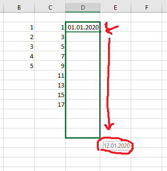

Wie oben bei den Zahlen, kann man auch hier Folgen haben, die Excel erkennen kann:

Probiere das ganze einfach mal aus:

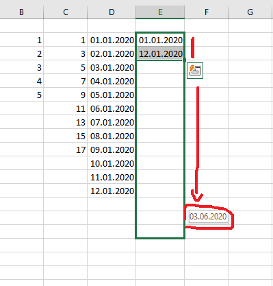
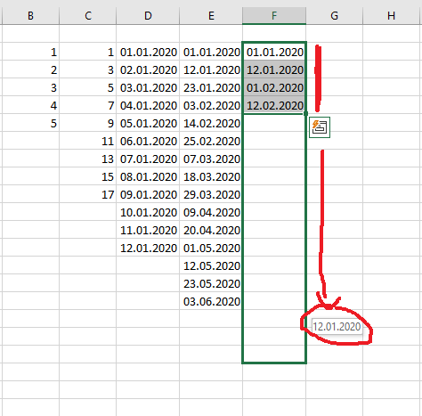

Wiederhole das ganze für 50 Zeilen mit:

* 10.01.2020, ... (fortlaufend)
* 10.01.2020, 12.01.2020, ...
* 01.01.2020, 03.01.2020, ...
* 01.01.2020, 03.01.2020, 16.01.2020, ...
* 01.01.2020, 01.02.2020, ...
* 31.01.2020, 31.02.2020, ...

Was fällt dir beim letzten Beispiel auf?

Es funktioniert nicht, aber warum. Nun den 31.02.2020 gibt es nicht das ist kein gültiges Datum. Excel akzeptiert zwar die Eingabe, macht daraus aber keinen Datumswert, sondern nur einen einfachen Text. Texte sind nicht abzählbar, Excel kopiert in diesem Fall die Zellen einfach nur. Probiere es einfach aus.

## Excel bietet Optionen an

Nachdem man die Maus nach unten gezogen und wieder losgelassen hat, erscheint eine kleine Drop-Down-Box. Diese bietet einige Optionen, was man eigentlich in der Datenreihe erweitert haben möchte:

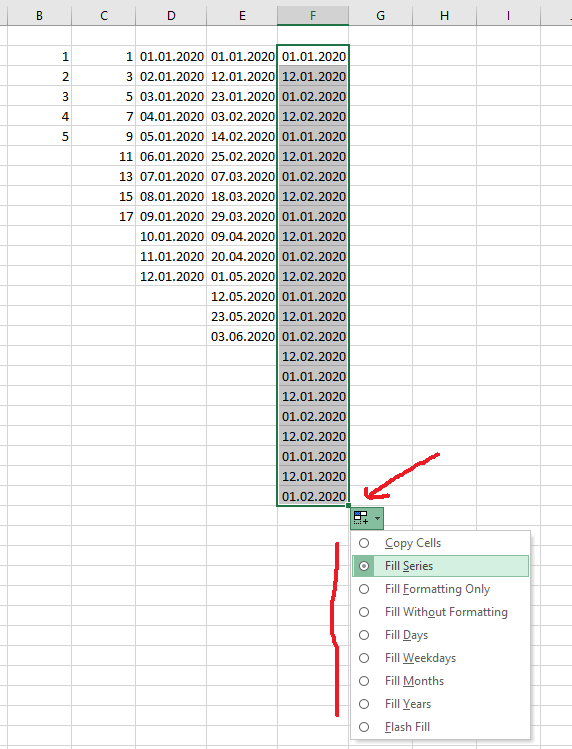

* Mit **Zellen kopieren** bewirkt man eine einfache Wiederholung, auch wenn Excel eine Logik in der vorgegebenen Folge erkannt hat.
* **Datenreihe ausfüllen** ist das Gegenteil von Zellen kopieren und bedeutet, dass Excel die Reihe fortschreibt.
* Möchte man im Zielbereich keine Inhalte einfügen und stattdessen nur die Formatierung der Ausgangszellen kopieren, wählt man **Nur Formate ausfüllen**.
* Soll im Zielbereich die bestehende Formatierung belassen werden, dann fügt Excel durch **Ohne Formatierung ausfüllen** lediglich die ermittelten Werte ein.

Wiederhole folgendes für 50 Zeilen mit:

* Jänner, Februar, ...
* Jan, Feb, ...
* Montag, Dienstag, ...
* Januar, Februar, ...

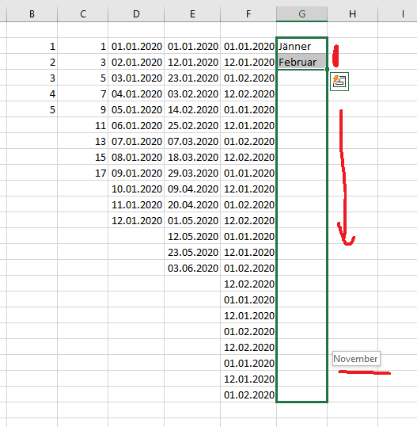

Was fällt dir bei beim letzten Beispiel auf? Schreibe es in einem Kommentar in das Excel-Sheet unter die letzte Zeile.

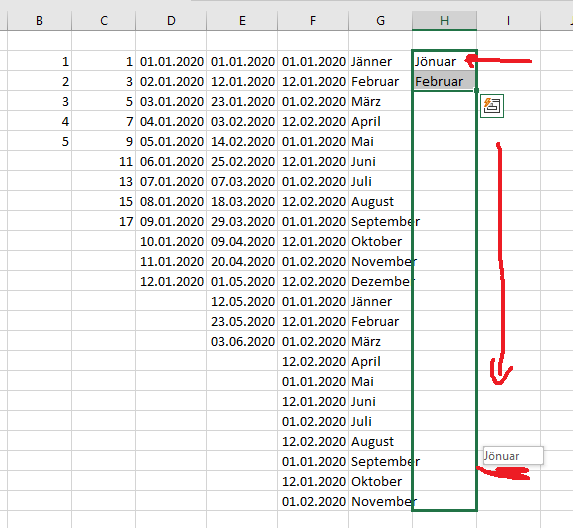

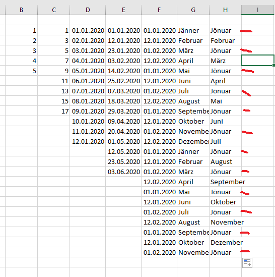

## Was geht nicht

Kompliziertere Folgen, wie etwa die Folge der Quadratzahlen erkennt Excel nicht. Genausowenig kann es mit Buchstabencodes umgehen. Dann erscheinen in der Vorschau meistens ungerade Zahlenwerte, die dir sagt, dass die Erkennung nicht funktioniert.

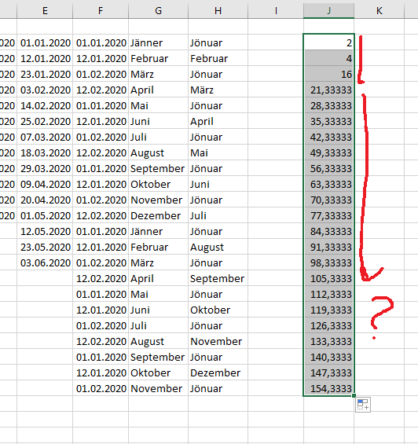

Textreihen werden auch nicht erkannt. Hier wiederholt Excel einfach nur die Reihe so wie man sie eingegeben hat.

Wiederhole folgendes für 50 Zeilen mit:

* A, B, C

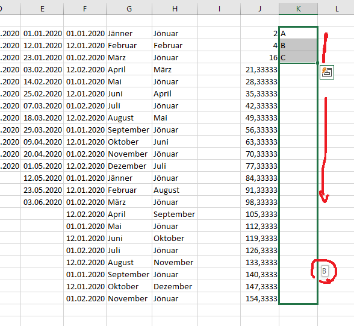

Nochmal 2 kleine Videos zum besseren Verständnis:

* <https://www.youtube.com/watch?v=tUt_iiROsEc&feature=emb_logo>
* <https://www.youtube.com/watch?v=IOMvRm48TnU>
