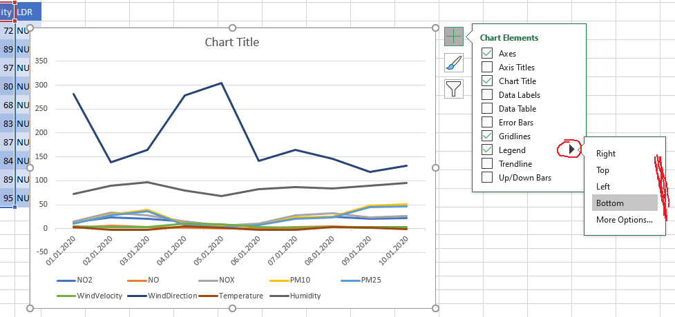
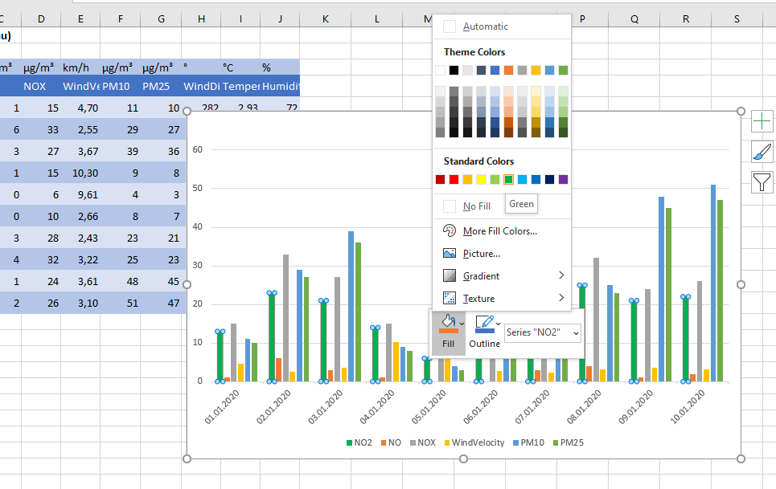
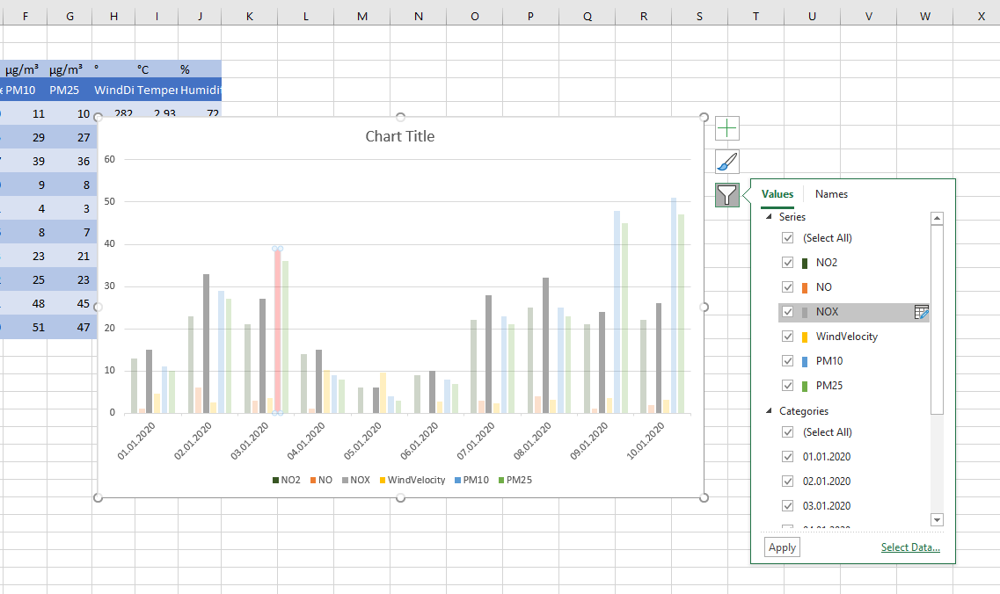

# Diagramme in Excel

Ein wichtiges Thema das einem in Excel immer wider begegnet, ist das Erstellen von Diagrammen. Es ist im Pronzip sehr einfach, allerdings gibt es dabei einige kleine Fallen, die einem wiederfahren können. Ich möchte diese gerne aufzeigen.

Zunächst erstellen wir ein Diagramm. Wie gesagt, es ist wirklich sehr einfach

## Ein Diagramm erstellen

Im Normalfall hat man eine Tabelle bestehend aus Werten vorgegeben. In diesem Beispiel sind es die Luftwerte für die Lobau Anfang Jänner.

Anschließend auf Insert klicken und das Diagramm seiner Wahl einfügen. Schon erscheint das Ergebnis, sogar in einer ganz passablen Formatierung.

Wenn man nicht sicher ist, welche Diagrammart für die vorhandenen Daten passen ist, kan Excel sogar die Daten überprüfen und einen geeigneten Diagrammtyp vorschlagen. Sehr komplizert ist das nicht, da für die meisten Zahlenwerte Linien oder Balkendiagramme gut geeignet sind. Diese Diagrammtypen werden auch häufig verwendet.

Auf OK klicken und das Diagramm ist da.

## Diagramme formatieren

Klicket man auf das Diagramm, hat man nun merhere Möglichkeiten das Diagramm zu verändern und zu fotrmatieren.

Am rechten oderen DRand erscheinen drei Icons, ein Plus, ein Pinsel iúnd ein Filter Icon

### Das Plus-Icon

Dient dazu um Elemente im Diagramm anzuzeigen oder auszublenden. Es funktioniert gleich wie ein Kontext-Menü und kann auch Untereleemente enthalten. Einfach auf die entsprechende Check-Box klicken und das gewünschte Element aktivieren, oder deaktivieren.

### Das Pinsel-Icon

Dient zur ormatierung. Man kann hier aus einer Vielzahl unterschiedlicher Formatvorlagen auswählen.

Es ist aber auch möglich das Diagramm selbst zu gestalten, wie man möchte. Wir haben das bereits in Power-Point kennen gelernt. Hier funktioniert es ganz ähnlich. Um eine Balkenreihe (in einem Balkendiagramm) zu formatieren, diese einfach anklicken. Die Balkenreihe wird hervorgehoben. Anschließend kann man die Reihe belibig formatieren. Möchte man nur ein Element formatieren, also nur einen Balken, klickt man einfach auf den Balken, den man formatieren möchte um ihn zu aktivieren. Die folgende Bilderreihe veranschulicht das etwas:

Die DatenrBalkenreihe einfach anklicken:

Dann dieFormatierung ändern:

Oder nur einen einzelen baklen hervorheben, weil man dessen Wert besonders markieren möchte:

### Das Fitler-Icon

Das FIlter-Icon dient dazu um schnell Daten aus dem Diagramm auszublenden, die man doch nicht anzeigen möchte.

**Achtung** Excel hat für viele, fast alle Funktionen eine Vorschau bereit. Man fährt mit der maus über das Menü oder Icon und sieht im HIntergrund schaon das zu erwartende Ergebnis. Das gibt es nicht für alle Features. Die Filterung ist so eines. Nicht vergessen, hier auf Apply zu drücken!

## Daten für das Diagramm

Die Tabelle hat mehrere Spalten mit unterscheidlichen Einheiten. Es macht natürlich keinen Sinn unterschieliche Einheiten in einem Diagramm mit einer Y-Achse darzustellen. Her sollte man merhere Diagramme erstellen. Alle Werte mit der gleichen EInheit NO2, NO, NOX, ... können in einem Diagramm dargestellt werden. Die Temperatur oder die Windgeschwindigkeit hat darin aber nichts verloren.

Die Windrichtung ist wiederum ein Wert, der in einem Balkendiagramm oder Liniendiagramm gar keinen Sinne ergibt.

Also die Spalten entsprechend gruppieren, bevor man das Diagramm erstellt.

Nun kann amn auch die Axenbeschriftung einblenden und mit der Einheit der Werte versehen.

Einfach kopieren:

## Das Datenrechteck

Excelkann Daten für das Diagramm am besten analysieren, wenn sie rechteckig ausgewählt werden. Inklusive Überschrift und der Beschriftungszeile, die meistens die ganz Linke ist.

Es kann natürlich auch vorkommen, dass Datennicht sauber aneinader gereiht sind, sondern sich dazuischen Splaten mit anderen Daten befinden, die nicht ins Diagramm sollen. Dann ist es ratsam, den Datenblock, Splate für Splate auszuwählen und auch nicht auf die Überschriften vergessen.

**Wichtig** In der ersten Splate, also der beschriftungsspalte, nicht die Überschriftenzelle vergessen. In diesem Beispiel steht "Datum" drinnen, die kann aber auch leer sein. Dann übersieht man sie schnell. Excel kann dann die Daten nicht korrekt analysieren.

## Datenreihen hinzufügen

Man kann einem bestehenden Diagramm Datebnreien hinzufügen oder auch wieder löschen. Dazu im Ribbon auf das Chart Tools und dann auf Select Data klicken. (siehe Screenshot) .

Im Dialogfemster das dann ersheint, kann man die Datenreihen editieren:

Möchte man eine datenreihe hinzufügen, auf Add klicken. Dann erscheint folgendes Fenster:

Das Fenster enthält 2 Zeilen. Hier wählt man in der oberen Zeile, die zelle aus, welche sdie Überschrift enthält. in der Zeile darunter den bereich, deren Werte im Diagramm dargestellt werden sollen. Dann auf OK klicken.

## Probleme mit Zahlen in Überschriften

Wie bereits eerwähnt, gibt es Diagrammtypen, die sich für die darstellung ubnterschiedlichster Werte sehr gut eignen. Das Balken oder Liniendiagramm, zum Beispiel.Aber es gint noch andere.

Nicht immer eignet sich das Tortendiagramm (Kreisdiagramm). Möchte man 3 Datenreihen in einem Tortendiagramm dastellen, funktioniert das natürlich nicht, da das Tortendiagramm nur eine Datenreihe darstellen kann.

Obwohl ich hier 3 Spalten für das Diagramm gewählt habe, ist nur eine Splate im Kreisdiagramm sichtab, nämlich die erste. Alle anderen werden ignoriert. Also aufpassen, welches Diagramm am für welche Problemstellung verwendet.

## Ein Diagramm verschieben

Manchmal ist es ratsam große Diagramme, die viele Daten enthalten auf ein eigenes Arbeitsblatt zu verschieben. Das funktioniert so:

