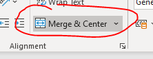
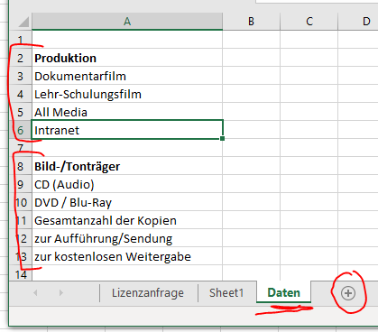

# Formular formatieren

Excel eignet sich als Tabellenprogramm gut dazu Worksheets in Form von Formularen zu gestalten. Heute werden wir einFormular gestalten.

Folgendes Formular soll erstellt werden:

Das ganze ist eine kleine Soielerei. Aber ich möchte einige Tips geben, wie man an die Sache herangehen kann:

Jedes Feld, bzw. dazugehöriger Feldname ist eine Zelle Wir müssen also die breiten der Zellen so verändern, dass sie der Vorgabe entsprechen

## Schritt 1

Jenen Bereich im Formular ermittel, der die meisten Zellen in der Breite benötigt.

Vorname, Max, Nachname, Muster = 4

X, Dokumenatarfilm, X, Lehr-Schulungsfilm, X, All Media, X, Intranet = 8

...

Das ist also eindeutig die zeile unterhalb "Bitte angeben", mit den X-Feldern

Also die ersten 8 Spalten im  Worksheet auf die entsprechende Breite ändern: (Ändern der Splatenbreite durch Rechtsklick auf den Splatenzwischenraum in der Splatenüberschrift (graue Zeile ganz oben))

3, 18, 3, 18, 3, 18, 3, 18

Die Zellen, die Checkboxen darstellen sollen, können dann gleich umramt werden:

Und die Bezeichnungen können eingefügt werden:

**Erinnerung zu Rahemnformatierungen**

## Schritt 2

Setzten wir mit dem Block darunter fort. Man kann sehen, dass die Bezeichnungen in der Splate E über die Zellen hinausragen.

Nun gibt es viele Möglichkeiten das zu formatieren. Wir machen das mal folgendermaßen:

Spalte E wird breiter gemacht, dann  müssen wir natürlich eine andere Spalte um den gleichen Wert schmäler machen. Hier: Spalte G (die eiget sich auf grund des Inhaltes am besten)

## Schritt 3

Den Block "Sonstige Kopien" müssen wir irgendwie unterbringen. Das geht sich mit den vorhandenen Spalten nicht aus:

Hier ist es erstmals notwendig, Zellen zu verbinden um ein auberes Formularfeld zu erstellen. Wir benötigen nach Spalte F eine weitere Splate, gleicher Breite, die den Abstand zwischen den Feldern in Spalte G und dem Feld "Sonstige Kopien" darestellen wird.

Also: Rechte maustaste auf Spalte F und auf Einfügen klicken. gegebenenfalls die Spaltenbreite verändern. Die Splate J muss dann um entsprechend verringert werden.

Jetzt kann die entsprechende Range für das Formularfeld umrahmt werden:

## Schritt 4

Als nächstes erstellen wir die Zeilen für die Playlist darunter. Dabei schreiben wir mal die Spaltenüberschriften in jene zellen, in die es am besten passt. Das passt wir man sieht eigentlich ganz gut. Das Feld Titel darf etwas breiter sein, das Feld Länge enthält die Länge eines  Songs in Sekunden, das wird wohl nur 3-stellig sein (z.B.: 240 Sek) Wenn wir Glück haben geht sich das weiterhin schön aus. ich sags gleich, das wird es nicht.

## Schritt 5

Eine kleine Hürde ist noch der oberste Block mit "Vorname" und "Nachname". die Felder sollen so platziert werden, dass sie etwa gleich groß sind und das Formular etwa in der mitte teilen. Wieder müssen wir Zellen verbinden.

Man kann sehen, dass sich das für den Vornamen gut ausgeht, für den Nachnamen aber gar nicht.

Das gleiche Spiel nochmal. Wider eine neue Splate nach der splate E einfügen. Diese nun auf die Breite 1 reduzieren.

Die Bezeichnung Nachname ist  nun immer noch zu lang. Daher eine weitere Spalte nach H einfügen. (Also auf "H" rechts klicken und auf "Splate einfügen")

jett geht sich das schün aus. Allerdings muss nun die brreite von einer anderen Splaten wieder reduziert werden, damit die Gesamtbreite gleich bleibt. Nehmen wir die Splate L um 4.

## Schritt 6

Jetzt gehts an den Endspurt. An das Zellen verbinden. Einfach den Bereich (Range) der Zellen auswählen, die man verbinden möchte und auf das Icon im Ribon klicken:

Das machn wir nun für alle Felder, die sich über mehrere Zellen erstrecken:

Jetzt noch der Bereich der Play List. Hier werden ebenfalls alle zellen verbunden, damit das entsprechende Feld eine Zelle wird.

Achtung! Das bitte immer Zeilenweise tun, sonst wird der die Spalte zu einem einzigen Block. Das soll nicht sein.

Anschließend kann man auch diesen Bereich mit einem Rahmen versehen.

## Schritt 7

Im oberen Block möchte ich jetzt noch eine weitere zeile einfügen, die sich mit der ersten Zeile in etwa decken soll:

Man kann sehen, das Wort Bild/Tonträger ist mal wieder zu lange für den Bereich. Also wieder daselbe Spiel. Wieder eine neue Splate einfügen, dafür eine andere SPlate schmäler machen.

Nun passt das Ergebnis. Die verbundenen zellen bei Komponist in der Play List muss nochmal nachgearbeitet werden. Dazu kann man die Verbindin wider auflösen (Icon "Zellen verbinden" klicken um die Verbindung zu deaktivieren und neu setzten (Icon "Zellen verbinden" klicken um die verbindung zu aktivieren)).

Nun wird das Formular noch etwas formatiert. Dabei sind der Kreativität keine Grenzen gesetzt.

## Schritt 8: Eine Drop Down Liste im Formularfeld

Im Feld "Produktion" und "Bild/Tonträger" möchte ich ein Auswahl mittels Drop-Down-Feld erstellen:

**Wie geht das?**

Es ist ganz einfach. Wir benötigen ein 2. Worksheet mit den Daten die in den beiden Drop-Down-Feldern angezeigt werden sollen:

Also auf das Plus ganz unten klicken, es erscheint ein neues Arbeitsblatt und dann dafür einen namen eingeben. z.B. Data. Anschließend die anzuzeigende Liste in irgend eine Splate eingeben. Ganz egal welche.

Als nächstes wählt man jene Splate im Formular aus, in der man die Drop Down Liste haben möchte un klickt im Ribbon auf "Daten", anschließend auf 

Es öffnet sich ein Dialogfeld in dem man nun Kriterien auswählen kann. In der obersten Drop-Down-Box "Liste" wählen und anschließend den Bereich, wo die Daten für die Liste gefunden werden können. Auf das Icon klicken und den Bereich auf dem Worksheet "Data" auswählen. Bitte für die beiden Drwop-Down-Boxen im Formular die beiden bereiche separat auswählen.

Das für beide Felder im Formular durchführen und die Übung ist erledigt.

Hier habe ich noch ein kurzes video gefunden, welches die Drop-Down-Box in Formularen nochmal erklärt:

https://www.youtube.com/watch?v=FZPyAFo2qKM