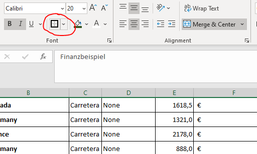

# Excel Grundlagen

Um euch mit den Grundlagen zu Excel etwas vertraut zu machen, würde ich euch bitten folgende 2 You-Tube Tutorials anzusehen. Sie dauern nicht lange und sind wirklich einfach gehalten. Dennoch ist es ein guter Start, da ich dann davon ausgehen kann, das dann alle den gleichen Wissensstand haben.

1. https://www.youtube.com/watch?v=rwbho0CgEAE (The Beginner's Guide to Excel - Excel Basics Tutorial)
2. https://www.youtube.com/watch?v=lxq_46nY43g (Intermediate Excel Skills, Tips, and Tricks Tutorial)

Wer der Meinung ist, dass er das schon alles kann, kann das Tutorial natürlich auslassen, oder es nur für das Übungsbeispiel zu Hilfe nehmen. 

Für den Anfnag werden wir uns nur mit einfachen Funktionen beschäftigen, der **Formatierung**.

## Ergänzungen zur Formatierung

Im Video werden einiges Dinge nicht erwähnt, die ich aber durchaus als interessant/wichtig erachte. Diese möchte ich kurz erwähnen.

### Die Formatierungsfunktionen

Die Formatierungsfunktionen sind, wie wir es ja auch schon in Word gesehen haben, im Ribbon untergebracht. Der Block sieht jenem in Word sehr ähnlich. Die meisten Funktionen sind ja auch ident.

Diese Funktionen werdet ihr in dem Übungsbeispiel verwenden müssen. Die meisten davon sind, ähnlich wie in Word durchaus selbsterklärend und auf einige davion wird auch im Video eingegangen, wie z.B. das Verbinden von Zellen. Die Funktion dafür heißt "Merge & Center". Dabei muss man eine Range (siehe Video) markieren und dann die Funktion daruaf wählen.

**!!Prinzipiell ist es in Excel IMMER so, das man zuerst eine Range wählt und dann die Funktion darauf ausführt!!**

### Rahmenformatierungen

Darauf möchte ich auch kurz etwas genauer eingehen, als es im Video getan wird. Das Icon im Ribbon gleicht de in Word. Auch die Funktion ist ähnlich. Die Zelle soll umrahmt werden. Der klick auf das Dropdown, gleich daneben, eröffnet weitere Möglichkeiten der Rahmenformatierung. Für die Übung sind die Optionen, die dieses Icon anbietet ausreichend.

Für weitere Formatierungsoptionen kannman auch in der Zelle oder Range die rechte Maustaste drücken und dann im Kontextmenü die Option "Format Cells" wählen. Im Dialog, welches sich dann öffnet, gibt es ebenfalls einen Reiter mit dem Titel "Border".

### Zellenbreite, Zellenhöhe

Im Video ist kurz erklärt, wie man die Breite der Zellen verändern kann. Dazu geht man mit der Maus zwischen zwei Spalten, klickt,  und verschiebt so, die Spaltenbreite. das gleiche funktioniert natürlich auch mit der Zeilenhöhe. Man wählt den Bereich zwischen zwei Zeilen am linken Rand und verschiebt die Zeilenhöhe. Wählt man vorher eine Range aus, so funktioniert das für alle Zeilen in der ausgewählten Range.

### Nummerformatierungen

Die Übungsaufgabe verlangt die Formatierung der Spalte "M" als Datum. In der Vorgabe steht in dieser Splate ein offensichtlich nicht ganz verständlicher Zahlenwert. Dieser Zahlenwert ist in Wahrheit ein Datum für Excel, nur ist es als Zahl formatiert. Dieser Zahkenwert muss nun als Datum umformatiert werden. Es ist nicht notwendig in die zelle einen neuen Wert (Datum) einzugeben. Die darin befindliche Zahl ist schon ein Datum, nur falsch formatiert.

Um das zu tun:
Wieder die rechte Maustaste auf die entsprechende Range (am besten du wählst die gesamt Spalte, indem du auf auf die Spaltenüberschrift klickst) und öffnest mit der linken Maustaste das Kontextmenü und wählst anschließend wieder "Format Cell". Im ersten Reiter lassen sich nun die Nummerformatierungen festlegen. Hier einfach ein Datum aus der Liste auswählen.

---

Ich denke, dass das für die Heutige Einheit mehr als genug Stoff ist. Ich stehe euch in der Stunde im Chat bei Fragen (die es bestimmt geben wird und auch soll) zur Verfügung!

Die Formeln am unteren Rand des Arbeitsbalttes und die Filterung muss NICHT gemacht werden. Das kommt in der nächsten Einheit. Wer Vorarbeiten möchte und das bereits kann, darf das natürlich tun und hat so das nächste mal weniger Arbeit.

---

Gutes Gelingen!