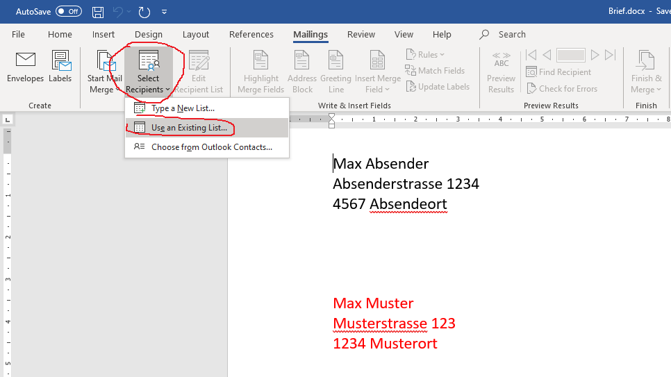
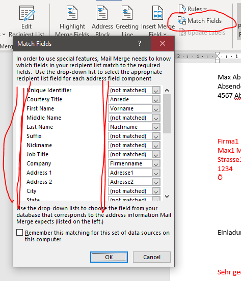
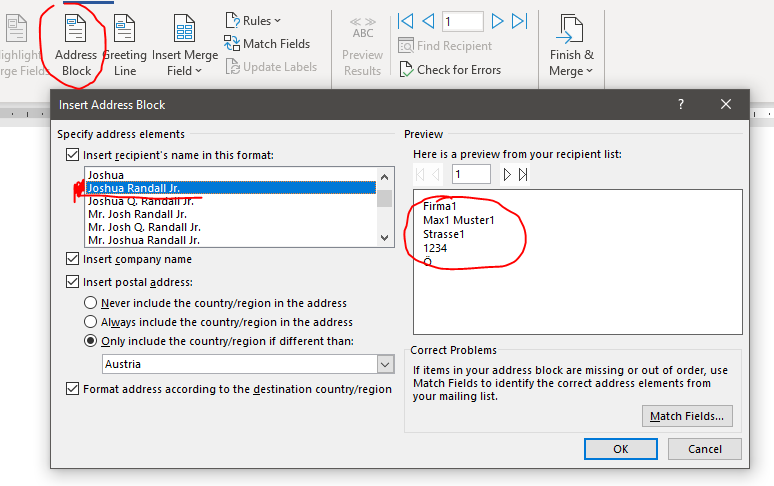
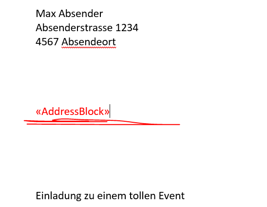
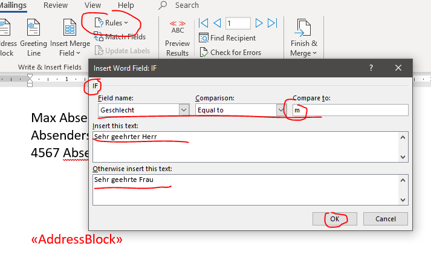
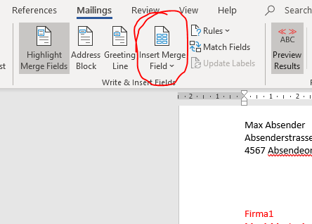
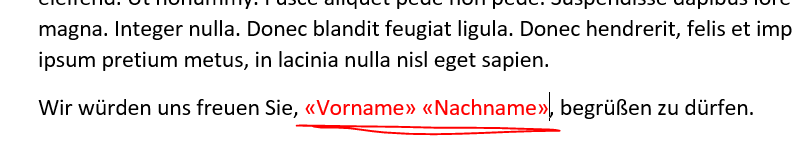
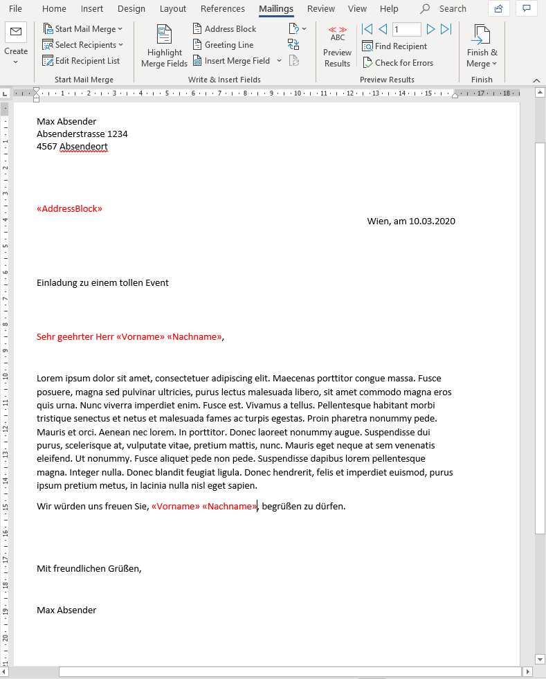
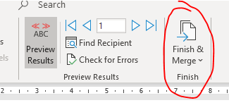
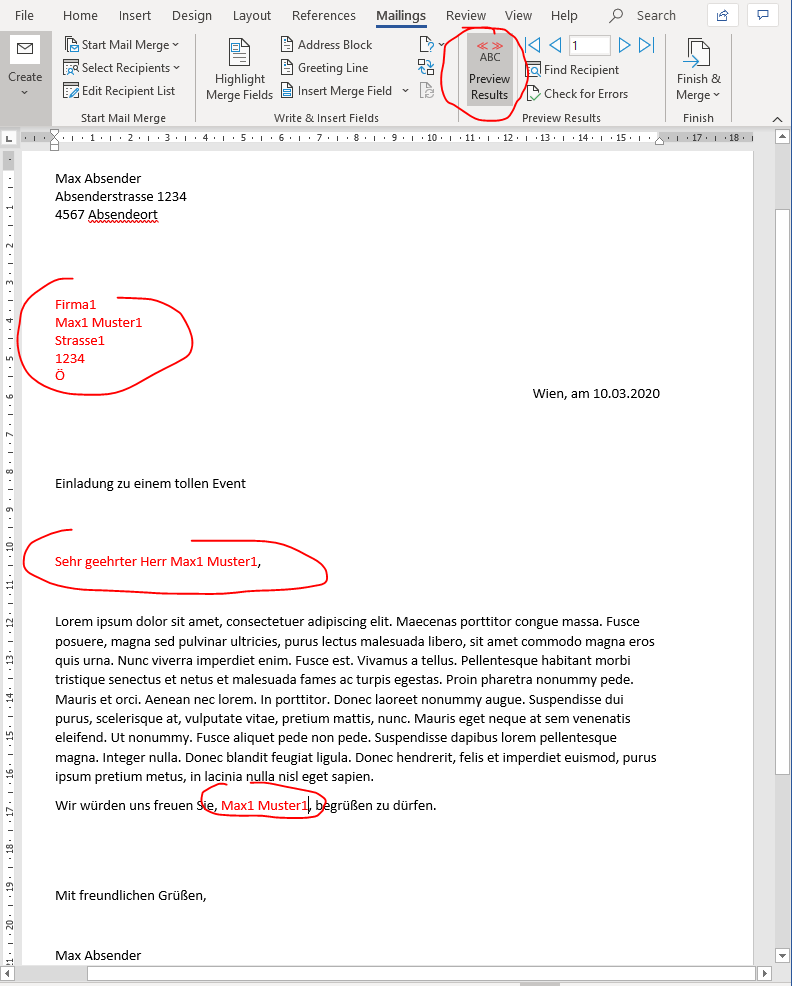

# Word Serienbrief

Ein Serienbrief ist ein Brief (bzw. eine ganze Reihe von Briefen) mit immer gleichem Inhalt, die jedoch an viele verschiedene Empfänger geschickt weden sollen. Ähnlich wie ein E-Mail-Newsletter, der mit immer gleichem Inhalt an unterschiedliche Empfänger geschickt wird.

Dafür muss sich natürlich zumidest die Empfängeradresse Brief für Brief ändern. Idealerweise auch andere Teile des Briefes, wie z.B. die Grußformel:

* "Sehr geehrter Herr Max Muster"
* "Sehr geehrter Herr Paul Hofer"
* "Sehr geehrter Herr Franz Müller"
* ...

Das Video kurz zusammengefasst:

Als erstes muss ein Brief geschrieben werden. Ein ganz normaler Brief. Anschließend werden aus einer Datenquelle (z.B. Excel) Adresse, Anrede, ... ersetzt (Der Brief wird personalisiert).

---
**Nun nochmal eine kurze Zusammenfassung der Informationen aus dem Video:**

## 1. Datenquelle auswählen

Word muss die Daten aus einer Datenquelle (z.B. Excel nehmen):

## 2. Felder überprüfen

Gegebenenfalls die Felder überprüfen, ob Word diese auch zuordnen kann:

## 3. Adressblovk ersetzen

Den Empfänger-Adressblock ersetzten:

Dazu den alten Adressblock löschen und an dessen Stele, über das Icon im Ribbon den Platzhalter "Adressblock" einfügen. Anschließend sieht das so aus:

## 4. Grußformel ersetzen

Das gleiche wird mit der Grußformel gemacht. Hier wird aber das Icon "Regel" im Ribbon verwendet:

Einfach drauf klicken und im Drop-Dwon-Menü den "Wenn-Dann"-Blovk verwenden. Wenn die Spalte Geschlecht "gleich" "m" ist dann "Sehr geehrter Herr", sonst: "Sehr geehrte Frau".

## 5. Weitere personalisierte Blöcke ersetzen

Im Prinzip kann man so alle möglichen Stellen im Text durch Daten aus dem Excel ersetzen. Einfach den gewünschten Platzhalter einfügen. Dazu verwendet man das Icon "Insert Merge Field":

## Das Ergebnis:

Dies sollte nun das Ergebnis der Übung sein: (Die roten Stellen sind nur zur Übersicht hervorgehoben. Diese sollten dann schon schwarz sein)

## Abschließend: Prerview und Merge

Wenn alles fertig ist, kann man sich in der Vorschau den fertigen Serienbrief ansehen. Er umfasst nun 100 Seiten. Alle mit dem gleichen Inhalt (Brief), aber unterschiedliche Absender und unterschiedliche Grußformeln.

Also hier klicken:

dann sieht das Ergebnis so aus:

---
Jetzt hast du alles richtig gemacht!